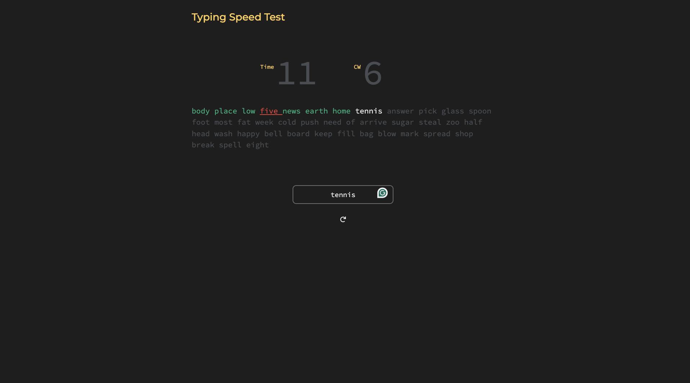

# Speed Typer



## Overview

The Speed Typer is an interactive web application designed to measure typing speed and accuracy. Developed using HTML5, CSS, DOM, and JavaScript, it presents users with a dynamic and engaging interface where they can test their typing skills under varying levels of difficulty. The application displays 40 words at a time, allowing users to adjust the difficulty according to their proficiency.

### Features

- **Dynamic Word Display**: 40 words are shown at a time, refreshing as the user types them correctly.
- **Difficulty Levels**: Users can choose their typing test's difficulty to match their skill level.
- **Real-Time Feedback**: Provides instant feedback on typing speed and accuracy.

## Getting Started

### Prerequisites

No prerequisites are needed to run the Typing Speed Tester in your browser. However, if you wish to run the project locally or contribute, ensure you have the following:

- A modern web browser
- A text editor or IDE

### Installation

To set up this project locally, follow these steps:

1. Clone the repository to your local machine:
   ```bash
   git clone https://github.com/aniketghumed23/TyperSpeed.git
   ```
2. Navigate to the project directory:
   ```bash
   cd typing-speed-test
   ```
3. Open `index.html` in your web browser.

## How to Use

1. **Choose Difficulty**: Select your desired difficulty level before starting the test.
2. **Start Typing**: Begin typing the displayed words in the input field. The timer will start automatically.
3. **View Results**: After completing the test or when time runs out, your typing speed and accuracy will be displayed.
